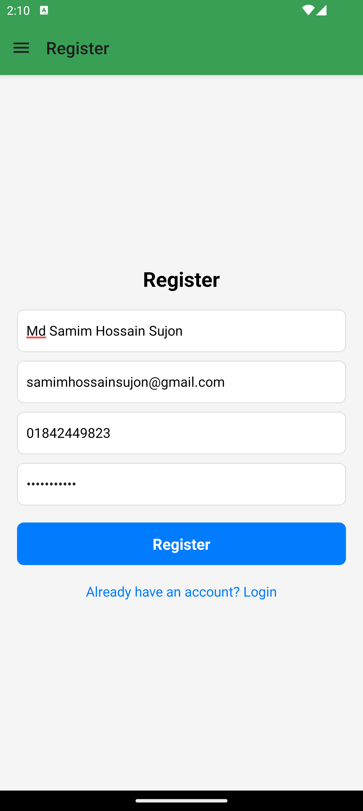
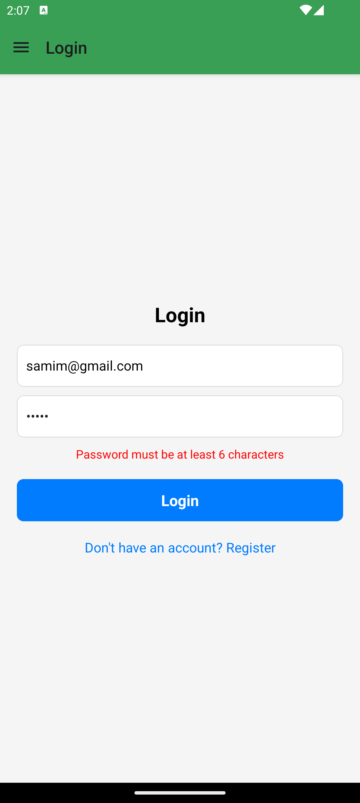
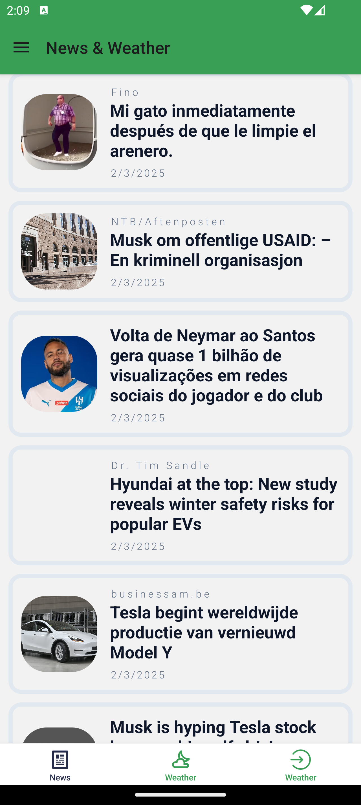
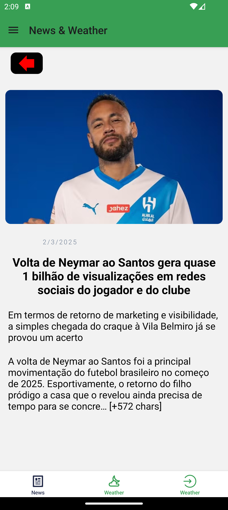
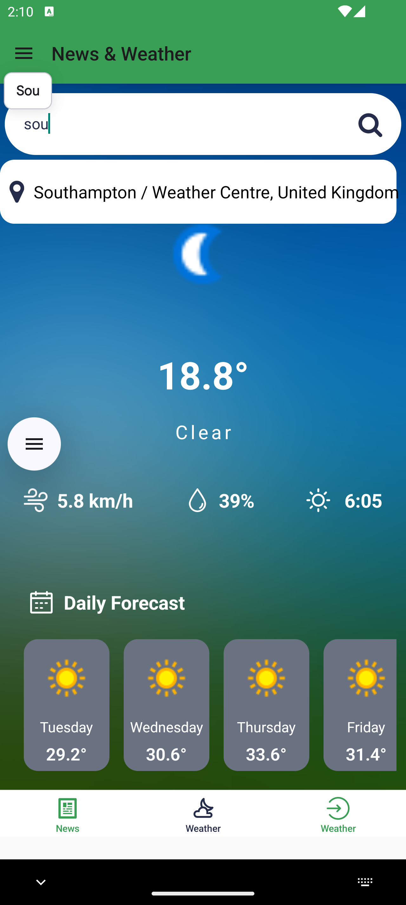
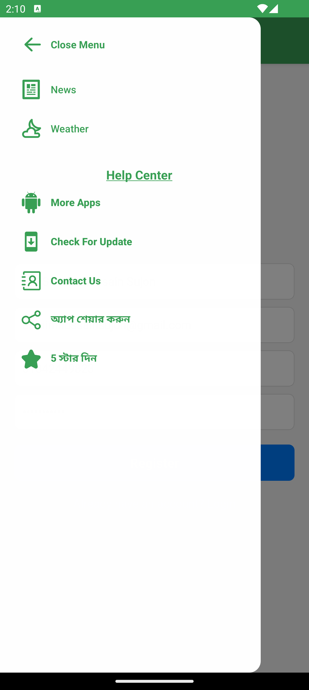

# 📱 News Weather Apps - React Native

## 🚀 Application Startup Guide

### 🔹 Step 1: Install Dependencies
Run one of the following commands to install dependencies:
```sh
yarn install
# or
npm install
# or
bun install
```

### 🔹 Step 2: Connect Emulator or Device
Ensure your emulator or real device is connected to your desktop/laptop.

### 🔹 Step 3: Start the Application
Run one of the following commands to start the application:
```sh
yarn start
# or
npm start
# or
bun start
```

### 🔹 Step 4: Run on Android Device (Only for Android Testing)
```sh
npx react-native run-android
```

### 🔹 Step 5: Open Windows Command Terminal
To select the development mode, run:
```sh
selet d
# or
press d
```

---

## 🧑‍💻 User Registration Guide
### Example Input Data:
```json
{
    "name": "Md. Smaim Hossain Sujon",
    "email": "samim@gmail.com",
    "password": "123456",
    "phone": "01842449823"
}
```


---

## 🔑 User Login Information
User login credentials must contain a 6-digit password.
```json
{
    "email": "samim@gmail.com",
    "password": "123456"
}
```


---

## 📰 App Screenshots
### News Section


### News Details


### Weather Information


### Drawer Navigation


---


